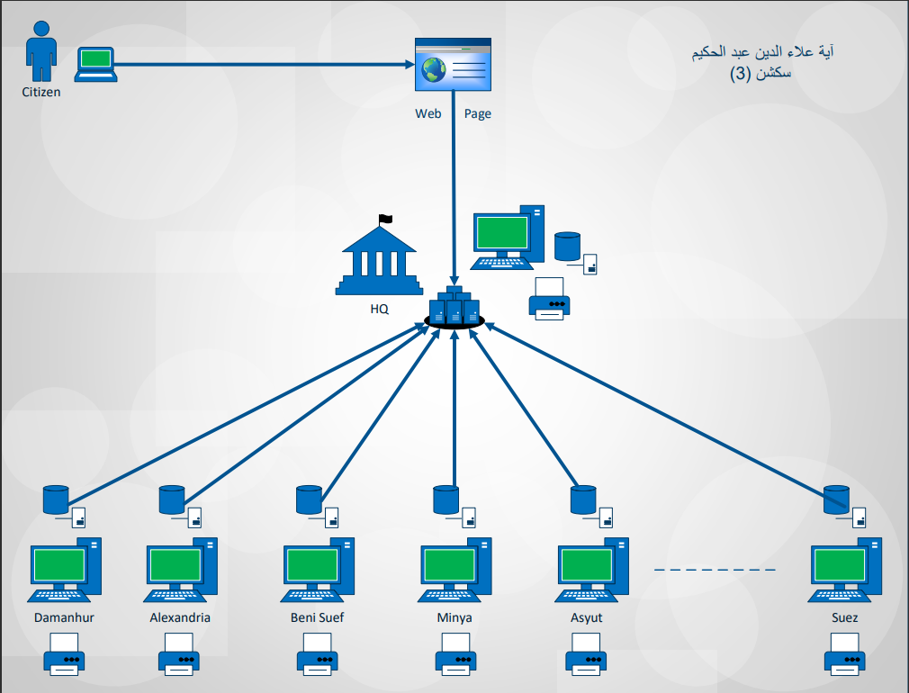
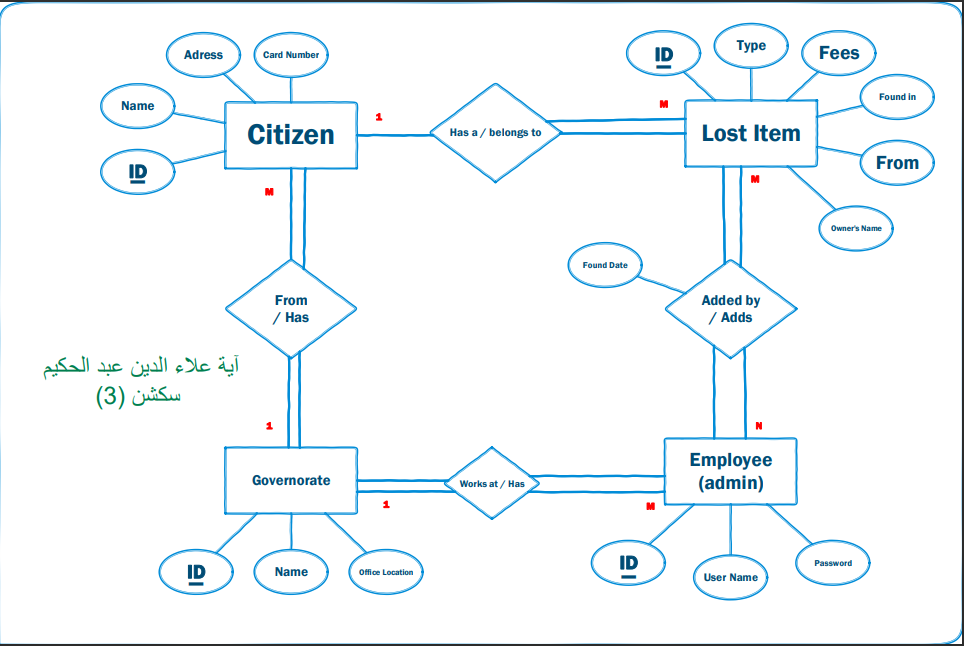
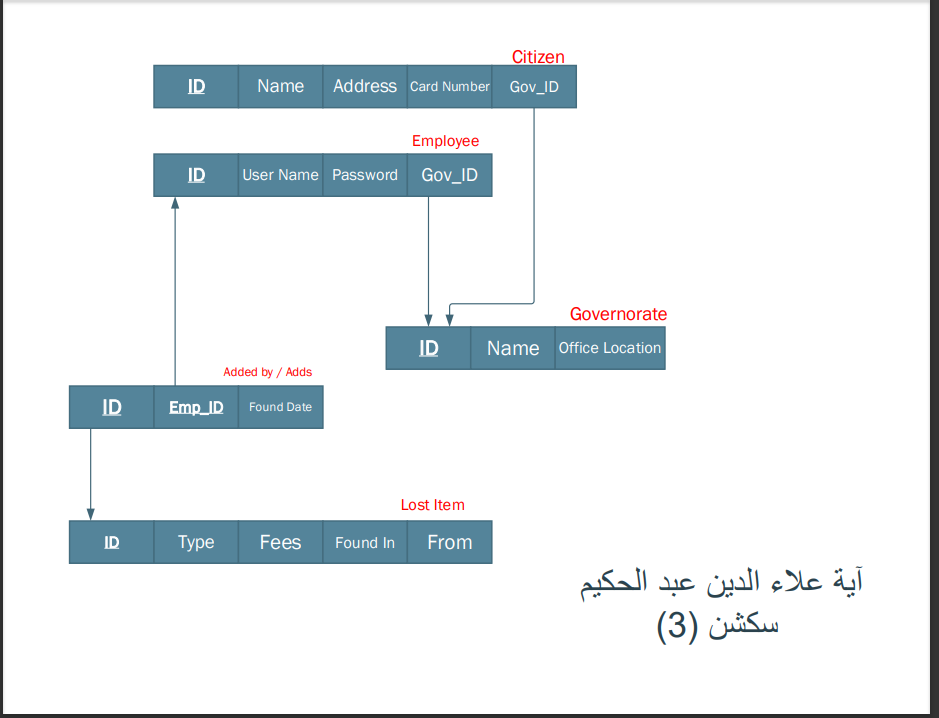

# Lost Found

A winform application for the citizens in Egypt to search for their **lost** items such as their passports, ids, ..etc as they want to know if their **lost** items have been **found** yet. If a citizens **found** a passport **lost** from another citizen, they give it to the government as an employer for the government can log in and add this **found** item.

<!-- ## Case Study -->

For more information check the [Lost Found](https://drive.google.com/file/d/1QFQ7fM30UPLpXCHuo447fVhCUHnhH8dm/view?usp=drive_link) case study.

The Lost Found [Demonstration](https://youtu.be/Qj0SzQ-HhVs).

> [!NOTE]
> Use these [data](required_data_for_the_interface.txt) to test the app.

## The System Technical Architecture

### Will the System use centralized or distributed computing?

The Computing is going to be “Centralized”.

### Will the system’s data stores be centralized or distributed?

The data stores going to be “Centralized”.

### Will SW be purchased, built-in house, or both?

The software is going to be“Purchased”. As there is going to be no contracting with any experts, and purchase all the needed applications.

### Selection of the operating system:

“Windows”. As all the computers in the governorate offices will be run by the “windows” operating system. Because it is the most common OS in Egypt.

### How users will interface with the system?

It is going to be alike dialogue with the user.

### How many data stores are required and inter-relationship among them?

We have two types of data stores to be added by the users of the system. The first type is the “add a lost item in the system”. The second type is the information about the employees that can log in to the system to edit, delete or add new lost items.

### What data storage technology will be used?

“NoSQL” database. As according to the case: the number of lost & found items in 2003 was 133512 items, at 2004 was 159123 items and at 2005 was 189263 items. So, the number of lost & found items is increasing and it is always a big number.

### What technology will be used to build programs?

Program technology could be written by “C#” or “Java” languages for desktop applications.

### What technology will be used to build input, output, and interface forms?

It could be the GUI for desktop applications like “windows forms” in “Visual Studio” as the technology for adding the input data and the output data is going to be that same technology type.

### How data input will be?

By forms as we have two types of users (a citizen & an employee), the data input will be the common data which are shared in each lost & found item like the name of the citizen, his lost item details, and his address in case of asking the system to send him his item to his location. Also, the citizen will be able to see a list of the fees assessed on all lost and found items. If the input is the new lost items that are added by the employees then it will be the item type, found at which governorate with the date of foundation, the governorate of the item, and the owner name for sure.

### How output data will be generated?

A screen as the output of the system could be the location of his lost & found item appeared in a table and if there is another item with a close name of his will be appeared as well. And a printing output as the bill that he needs to pay which will be printed in the office from where he is going to receive his item.

### How the system will interface with the legacy system?

There is no legacy system. This system is the first.

## System Technical Architecture Design

## ER Diagram

## ER Diagram Mapping

